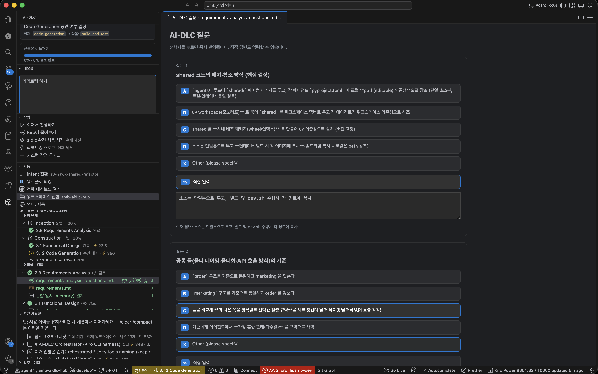
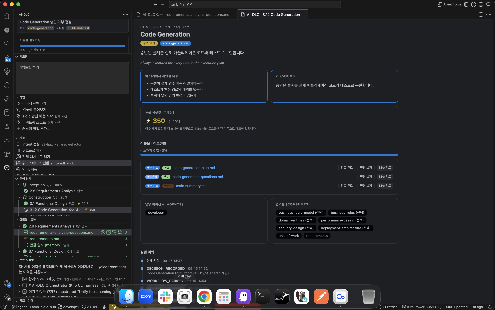

# AI-DLC Panel

**See where your AI-DLC workflow stands, what to do next, and how much it cost — right inside your IDE.**

No more digging through terminal logs or state files. One **AI-DLC** icon in the Activity Bar shows progress, artifacts, review status, and token usage, and lets you continue the workflow. The panel reads engine state **read-only** — it never touches or changes your workflow files.

AI-DLC Panel — stages with per-stage credits, and inline Q&A

Stage detail — token usage, review status, assigned agents, and execution history

## What you can do

- **Know where you are** — overall progress, current Phase/Stage, and the next action at a glance.
- **Review artifacts** — open the files each stage produced, mark them reviewed, and diff against the previous git state.
- **Answer questions inline** — click through choice questions, or review a summary and approve/request changes for confirmation-style questions.
- **Track token usage** — Kiro credit consumption per stage, per intent (cumulative), and per session.
- **Get notified on gates** — a status bar item and notification when the workflow is waiting for your approval.
- **Continue in one click** — resume the workflow in a fresh Kiro session.
- **Ask Kiro to review** — hand an artifact to Kiro for review.
- **Look back** — browse rules, knowledge, Q&A, and activity history read-only.

## Getting started

1. Install the extension.
2. Run **Developer: Reload Window**.
3. Open an AI-DLC workspace (a project with `.kiro/tools/aidlc-lib.ts` somewhere in it).
4. Click the **AI-DLC** icon in the Activity Bar.

On first activation the panel installs a small read-only tool (`panel-model.ts`) into the workspace's `.kiro/tools/`. No setup needed.

**Requirements**

- **VS Code `^1.74.0`** or Kiro IDE
- **[bun](https://bun.sh)** on your PATH (runs the read-only state tool)
- An **AI-DLC workspace** — one of the open folders must contain `.kiro/tools/aidlc-lib.ts`. In multi-root workspaces the engine folder is found automatically.

## Views

- **Overview** — active Intent, overall progress, artifact-review bar, next action, and pending reviews.
- **Tasks** — workflow buttons (Continue workflow / Ask Kiro) plus your custom actions.
- **Features** — panel utilities: Switch Intent / Park·Resume / Full dashboard / Switch Workspace / Language / Token usage on·off / Refresh. **Switch Intent and Switch Workspace show the current selection on the right.**
- **Stages** — a Phase → Stage tree with each stage's status (complete, in progress, awaiting approval, revising, pending, skipped). Click a stage for details (what to check, the goal, review status, an execution-history timeline, and this stage's token usage). The top row shows the **cumulative token usage of the current Intent**.
- **Artifacts & Review** — files grouped by stage, with review mark/unmark, review counts, **new/changed badges** vs git HEAD, diff, and "Ask Kiro to review".
- **Token Usage** — Kiro credit consumption per session and per stage (see below).
- **Reference & History** — rules memory, code knowledge (codekb), team knowledge, Q&A, observation diary, and activity history, read-only.
- **Tips & Help** — Scope, panel usage, and AI-DLC v2 tips in collapsible sections.
- **Notepad** — a simple per-workspace scratch pad.

## Token usage

The panel reads Kiro's local session logs (`~/.kiro/sessions`) **read-only** to show credit consumption. The unit is Kiro **credits** (not raw tokens); the **context-window usage (%)** is shown too. Both IDE and kiro-cli sessions are recognized.

**Three ways to view it**

1. **Per stage** — each stage shows the credits spent on it; the top of the Stages tree shows the **current Intent's cumulative total**. The stage-detail screen shows it as a card too.
2. **Per session (Token Usage view)** — a `session → intent → stage → turn` tree showing credits, elapsed time, and context % for each exchange.
3. **Filters** — from the view title bar you can switch **all workspaces ↔ this workspace** and filter by **month** (all time or a specific month).

**Turn it on/off** — the "Token usage tracking" row in **Features** toggles it (on by default). When off, no session logs are scanned.

> **Accuracy notes**
> - Per-stage / per-intent attribution is a best-effort **estimate** correlated by time against the workflow audit trail. Per-session and per-turn credits are exact from the logs.
> - `/clear` and `/compact` make Kiro erase that session's credit records. **To keep usage history, continue in a new session when context fills.** The view shows this reminder at the top.
> - So these numbers are a **lower bound** based on locally-retained logs and may differ from your account's billed total.

## Common tasks

- **Continue workflow** — the *Continue workflow* button opens a new Kiro session and sends `/aidlc`; the engine resumes from the last checkpoint.
- **Answer questions** — open `*-questions.md` in the dedicated screen. Choice questions save on click; direct input auto-saves. Confirmation questions show the summary and offer approve / request-changes buttons.
- **Approval gates** — when the workflow reaches a gate, the status bar shows `⏳ Awaiting approval` and a one-time notification appears; **Open stage** jumps to the detail.
- **Ask Kiro to review** — opens the target file as context and hands a review prompt to a new Kiro session.

## Commands

Available from the Command Palette (`Ctrl/Cmd+Shift+P`):

| Command | Description |
| --- | --- |
| `AI-DLC: Refresh` | Re-read state. |
| `AI-DLC: Switch Intent` | Change the active Intent. |
| `AI-DLC: Switch Workspace` | Pick which open AI-DLC project the panel targets. |
| `AI-DLC: Park / Resume` | Safely pause/resume the workflow. |
| `AI-DLC: Open Full Dashboard` | Generate and open the HTML dashboard. |
| `AI-DLC: Ask Kiro` | Open a new Kiro session with the current stage context. |
| `AI-DLC: Continue Workflow (new session)` | Ask a new Kiro session to continue the workflow. |
| `AI-DLC: Toggle Token Usage Tracking` | Turn token usage calculation on/off. |
| `AI-DLC: Probe Token Usage` | Report the usage summary read from local session logs. |
| `AI-DLC: Set Panel Language` | Choose English / 한국어 / Auto. |
| `AI-DLC: Probe Chat Commands` | Report the chat/new-session commands this build recognizes. |
| `AI-DLC: Initialize Panel` | Reinstall the model tool and refresh. |

## Language

The panel language is independent of the IDE: **English / 한국어 / Auto** (follows the IDE). Switch it from the Language row in **Features** or the `AI-DLC: Set Panel Language` command — it applies immediately, no reload needed.

## Privacy & data

This extension **reads local files only.** It reads the workspace's AI-DLC state files and Kiro's session logs under `~/.kiro/sessions` **read-only** to display them; it sends nothing over the network and never modifies engine or session files. Only your own settings (review marks, toggles) are stored in VS Code's local storage.

---

# 한국어

**AI-DLC 워크플로가 지금 어디까지 왔고, 다음에 무엇을 해야 하는지, 그리고 얼마나 썼는지를 IDE 안에서 한눈에 보여주는 패널입니다.**

터미널 로그나 상태 파일을 뒤지지 않아도, Activity Bar의 **AI-DLC** 아이콘 하나로 진행 상황·산출물·검토 현황·토큰 사용량을 확인하고 다음 작업을 이어갈 수 있습니다. 패널은 엔진 상태를 **읽기 전용**으로만 읽으며, 워크플로 파일을 건드리거나 바꾸지 않습니다.

## 시작하기

1. 확장을 설치합니다.
2. **Developer: Reload Window** 를 실행합니다.
3. AI-DLC 워크스페이스(폴더 어딘가에 `.kiro/tools/aidlc-lib.ts` 가 있는 프로젝트)를 엽니다.
4. Activity Bar에서 **AI-DLC** 아이콘을 클릭합니다.

**필요한 것**: VS Code `^1.74.0` 또는 Kiro IDE · PATH의 **[bun](https://bun.sh)** · `.kiro/tools/aidlc-lib.ts`가 있는 AI-DLC 워크스페이스.

## 화면 구성

- **현황** — 활성 Intent, 전체 진척도, 산출물 검토 진행바, 다음 할 일, 검토 대기 요약.
- **작업(Tasks)** — 이어서 진행하기 / Kiro에 물어보기 + 커스텀 작업.
- **기능(Features)** — Intent 전환 / 파킹·재개 / 전체 대시보드 / 워크스페이스 전환 / 언어 / 토큰 사용량 켜기·끄기 / 새로고침. **Intent·워크스페이스 전환 행에는 현재 선택이 오른쪽에 표시**됩니다.
- **진행 단계** — Phase→Stage 트리와 상태 표시, 단계 상세(확인 사항·목표·검토 현황·실행 이력·이 단계 토큰 사용량). 맨 위에 **현재 Intent 누적 사용량** 표시.
- **산출물 · 검토** — 검토 표시/해제, git HEAD 대비 변경·신규 배지, 변경 비교, Kiro에 검토 요청.
- **토큰 사용량** — Kiro 크레딧 소비를 세션별·단계별로 표시(아래 참고).
- **참조 · 이력**, **팁 · 도움말**, **메모장**.

## 토큰 사용량

Kiro의 로컬 세션 로그(`~/.kiro/sessions`)를 **읽기 전용**으로 읽어 크레딧 소비를 보여 줍니다. 단위는 Kiro **크레딧**(raw 토큰 아님)이며 컨텍스트 사용률(%)도 표시합니다. IDE·kiro-cli 세션 모두 인식합니다.

- **진행 단계별** 크레딧 + 현재 Intent **누적 총합**, **세션별** 트리(`세션→Intent→단계→대화`), **전체/현재 워크스페이스** 전환과 **월별 필터**.
- **기능(Features)** 뷰에서 계산을 **켜기/끄기**(기본 켜기). 끄면 스캔하지 않습니다.

> **정확도**: Intent·단계 귀속은 시각 기반 **추정치**이고 세션·대화별 크레딧은 정확한 값입니다. `/clear`·`/compact`는 해당 세션의 크레딧 기록을 지우므로 **컨텍스트가 찰 땐 새 세션에서 이어가세요.** 이 수치는 로컬 기록 기준 **하한값**이라 계정 실제 과금과 다를 수 있습니다.

## 개인정보 · 데이터

**로컬 파일만 읽습니다.** AI-DLC 상태 파일과 `~/.kiro/sessions` 세션 로그를 **읽기 전용**으로 읽어 표시할 뿐, 외부로 전송하지 않고 엔진·세션 파일을 수정하지 않습니다.

## License

[MIT](LICENSE) © b0ho
